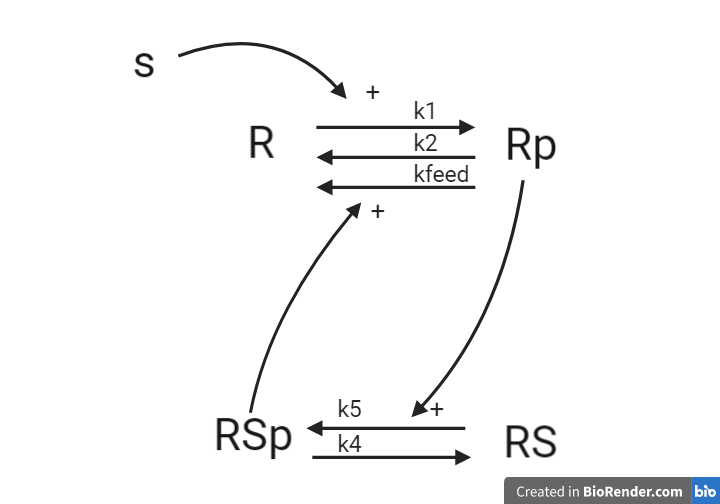

# Amici test model

This repo uses a small model to test parameter optimization using amici and pypesto. 

The model is shown below.

The main.py files converts the model equations in `M1.txt` using the odes2py function, and attempts to optimize the parameter values.  